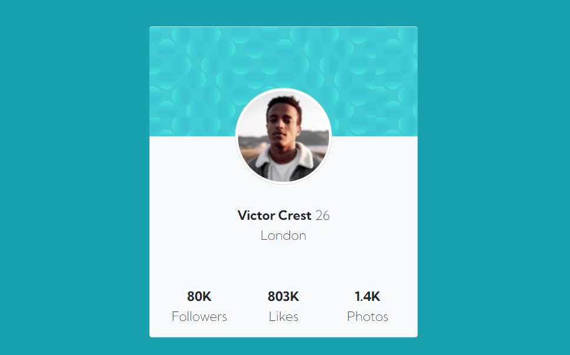

# Frontend Mentor - Profile card component solution

This is a solution to the [Profile card component challenge on Frontend Mentor](https://www.frontendmentor.io/challenges/profile-card-component-cfArpWshJ). Frontend Mentor challenges help you improve your coding skills by building realistic projects. 

## Table of contents

- [Overview](#overview)
  - [The challenge](#the-challenge)
  - [Screenshot](#screenshot)
  - [Links](#links)
- [My process](#my-process)
  - [Built with](#built-with)
  - [What I learned](#what-i-learned)
  - [Useful resources](#useful-resources)
- [Author](#author)
- [Acknowledgments](#acknowledgments)


## Overview
The challenge is to build out this profile card component and get it looking as close to the design as possible.
### The challenge

- Build a simple Profile card component for noobs xD

### Screenshot




### Links

- Solution URL: [Bootstrap5](https://getbootstrap.com/docs/5.1/getting-started/introduction/)
- Live Site URL: [Click here!](https://omarkhadaffi.github.io)

## My process

1. calculating all the columns and rows that I will be using
2. Fill the cols with a bunch of lorem/make a border for it, so I can visualize it
3. And continue with the flow! :D


### Built with

- HTML5 markup
- CSS custom properties
- [Bootstrap 5](https://getbootstrap.com) - Bootstrap Framework

### What I learned

I've learned a bunch of things, especially dealing with bootstrap grid system that is quite hard enough to undertand. But I managed to do it!

Here's my favorite snippet

```html
<div class="col-lg-6 col-6 bg-light">
  <p class="fs-5 text-center pt-3">
    <span class="ff lh-1">Victor Crest</span> 
    <span class="ffa">26</span> <!-- "ffa" class is DIY class for applying the font -->
    <span class="ffa">London</span>
  </p>
</div>
```
### Useful resources

- [Framework Indonesia](https://www.youtube.com/channel/UCFCDiQFrqj5zPMQnV-2zO2A) - This youtube channel helped me to understand the Bootstrap grid System. I like how he's explaining all the complicated stuff, and he's pretty straight foward. Absolutely recommended!
- [Web Programming Unpas](https://www.youtube.com/c/WebProgrammingUNPAS) - Fellow indonesian friends! Pak dika is the best. Trust me
- [W3schools](https://www.w3schools.com/) - I mean, who doesn't use W3School? Sometime I forgot what attribute I could use, also with the properties. And w3s made it easy!

## Author

- Website - [Omar Khadaffi](khadaffiomar.com)
- Frontend Mentor - [@OmarKhadaffi](https://www.frontendmentor.io/profile/Omarkhadaffi)
- Twitter - [@maneurm](https://www.twitter.com/maneurm)
## Acknowledgments

This is where you can give a hat tip to anyone who helped you out on this project. Perhaps you worked in a team or got some inspiration from someone else's solution. This is the perfect place to give them some credit.
